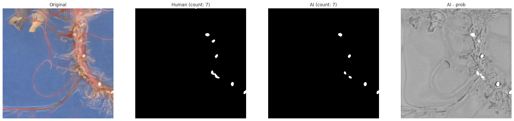
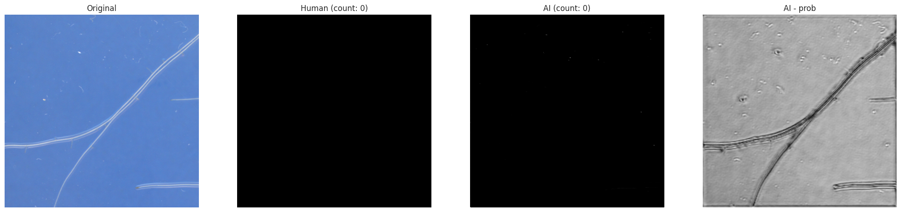
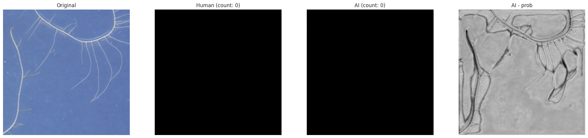

# Root Worm Detector
Neural network [`SE-ResNet`](https://arxiv.org/pdf/1709.01507) adaptation, specifically [`seresnet18`](https://amaarora.github.io/fastexplain/2020/07/24/SeNet.html) from Python library [`segmentation-models`](https://pypi.org/project/segmentation-models/) with `TensorFlow` (`Keras`) backend, was used for root worm detection.

## Examples
### Roots with worms



### Roots without worms



### No roots


## Installation
1. Clone the repository
2. Install python3
```bash
sudo apt-get install python3 python3-pip
```
3. Install the required packages
```bash
pip3 install -r requirements.txt
```

## Train your own model
0. Go to train folder
```bash
cd train
```
1. Prepare data into `x-original` (source images) and `y-original` (source annotated images) directories
2. If the resolution of source images is too high, run `prepare_data.py` to split source images into cropped image with overlap
```bash
python3 prepare_data.py
```
3. Train the model by opening the jupyter notebook `train_model.ipynb` and run the cells (if not using data preparation technique in step 2, just change names of `DATA_X` and `DATA_Y` directories)
```bash
jupyter-lab
```